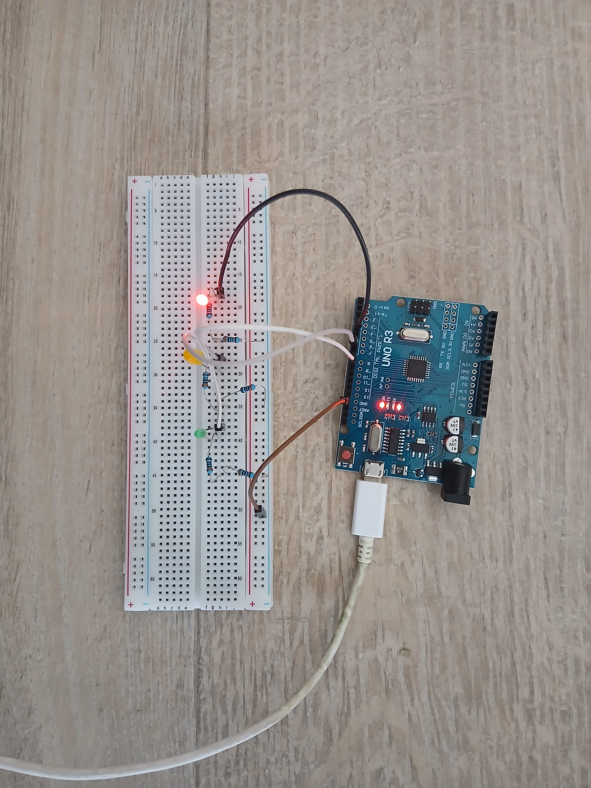

# Sequential Traffic Light Control System 🚦

## Project Overview
This project simulates a standard traffic light sequence using an **Arduino UNO** and **C++**. It demonstrates digital output control, timing logic, and electronic circuit prototyping using components in series.

## Features
- **Automated Sequence:** Green (3s) -> Yellow (0.5s) -> Red (3s).
- **Safety logic:** Ensures clear transition between states.
- **Hardware implementation:** Custom circuit design with current-limiting resistors.

## Hardware Setup
* **Microcontroller:** Arduino UNO R3
* **Actuators:** 3x LEDs (Red, Yellow, Green)
* **Resistors:** 2x 100Ω in series (Total: 200Ω) per LED for current limiting.
* **Wiring:** Direct Digital Pin connections (Pins 3, 6, 8).

## How to Run
1.  Connect the circuit as shown in the image.
2.  Open `traffic_light.ino` in Arduino IDE.
3.  Upload to the board.

---
*Engineered by [RGD]*
